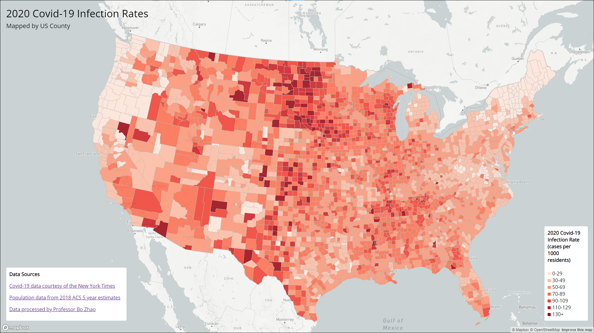
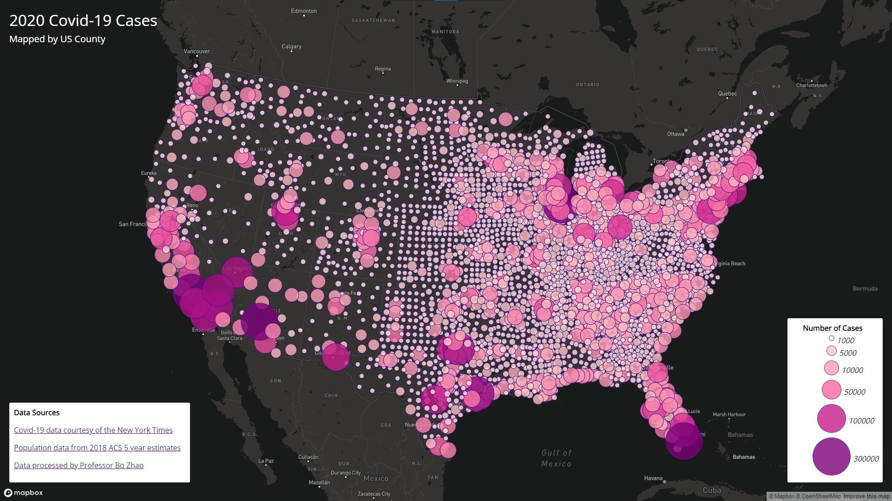

# Covid-19 Maps

This assignment had us create two maps of the continental US each with different thematic layers, one a choropleth map, and the other a proportional symbol map, both displaying data on Covid-19 from 2020. Both maps make use of the Mapbox gl js library to provide basemaps as well as to create the thematic layers. Both maps feature the ability to freely zoom and scroll around the map, are using the Albers projection, include interactive popups to gain more insight into the displayed data, and feature legends as well. The data used in this assignment were provided as shapefiles but were converted to the geojson format for use with the Mapbox library. 

## [Map 1](https://ehl7.github.io/Covid_Maps/map1.html)

Map 1 is a choropleth map that displays 2020 Covid-19 infection rates in the US, at the county level. Choropleth maps are good for mapping data relating to proportions of populations, not counts, so it is the appropriate type of map for showing infection rates. For this map I used a sequential color ramp as infection rates will range from low to high, there is no central or neutral value. An interactive feature of the map is that you can click on the counties to open a popup which displays the county name and exact infection rate.

## [Map 2](https://ehl7.github.io/Covid_Maps/map2.html)

Map 2 is a proportional symbol map that maps the total number of Covid-19 cases in each US county during 2020. Proportional symbol maps are good for mapping counts of populations because the size of the symbols helps the user understand that they are looking at counts and not proportions or intensities. I used a dark base map for this map to help provide contrast with the small and light symbols. An interactive feature of the map is that you can click on the symbols to open a popup which displays which county the symbol corresponds to and the exact number of Covid-19 cases in that county.

## Data Sources and Acknowledgements

- [Covid-19 data courtesy of the New York Times](https://github.com/nytimes/covid-19-data/blob/43d32dde2f87bd4dafbb7d23f5d9e878124018b8/live/us-counties.csv)
- [Population data from 2018 ACS 5 year estimates](https://data.census.gov/table/ACSDP5Y2018.DP05?g=0100000US$050000&d=ACS%205-Year%20Estimates%20Data%20Profiles&hidePreview=true)
- [Data processed by Professor Bo Zhao](https://github.com/jakobzhao)